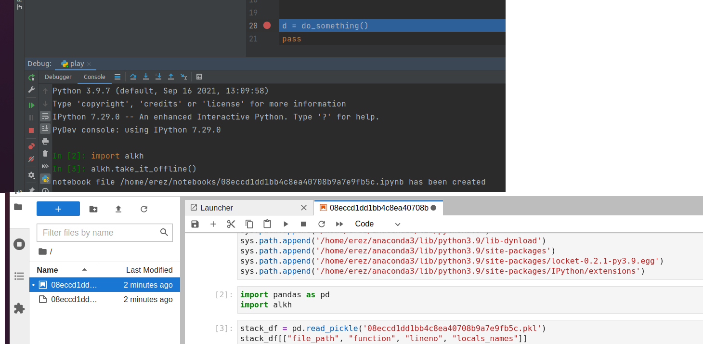

# alkh [al-khwarizmi]
systemtic python debugging using algorithms

1. Convert your stack to jupyter notebook

import alkh

alkh.take_it_offline('path-of-notebooks-directory')

or

bash:
export ALKH_NOTEBOOKS_PATH='path-to-notebooks-directory'

python:
import alkh
alkh.take_it_offline()

